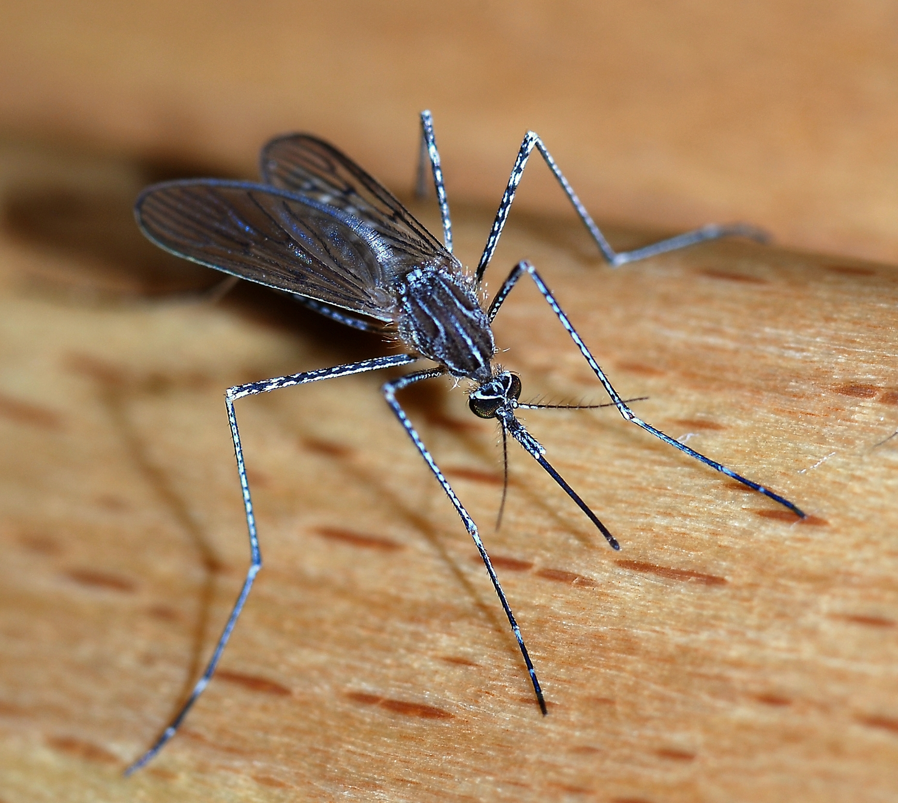
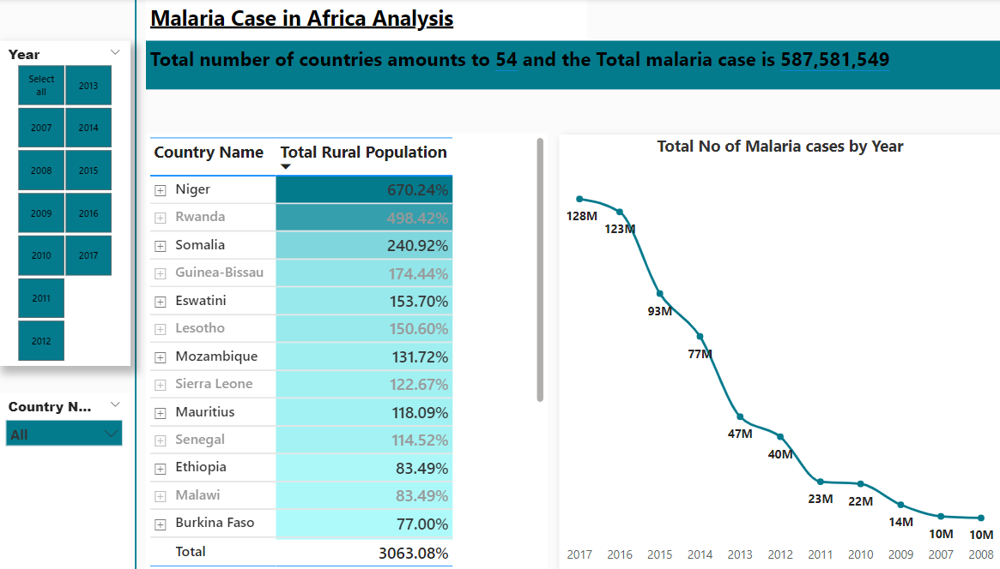
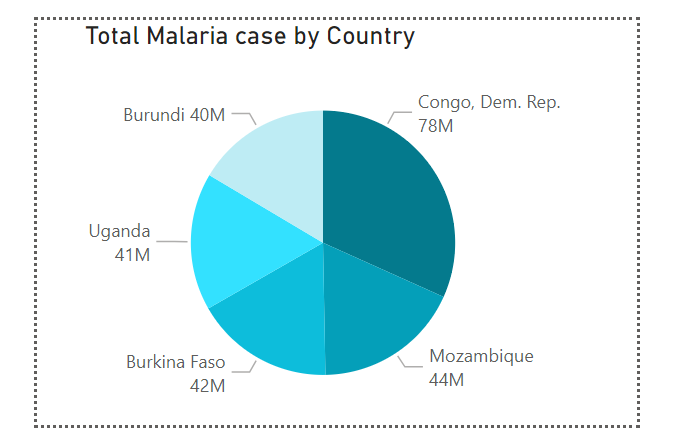
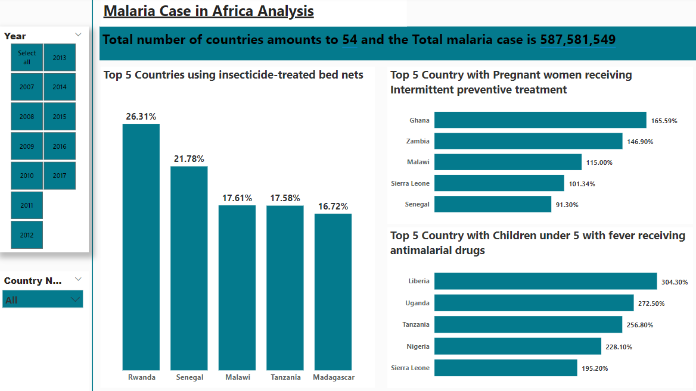
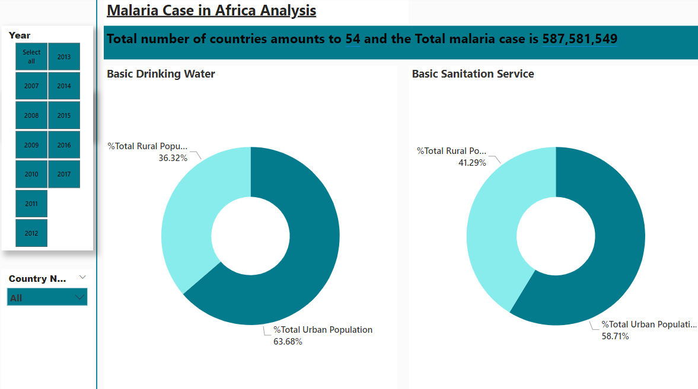
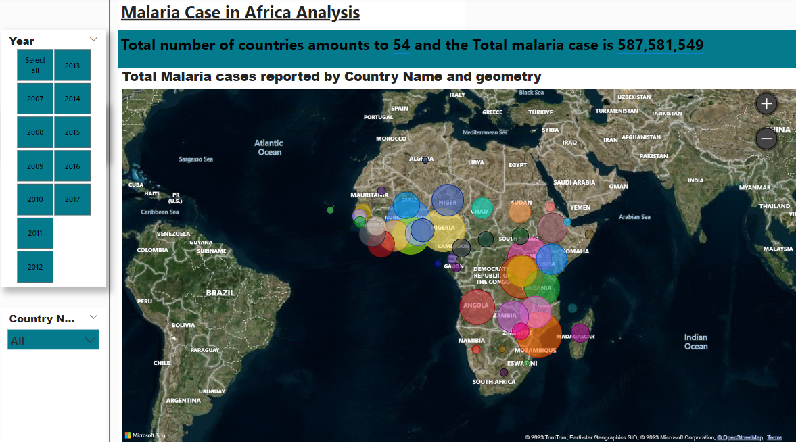
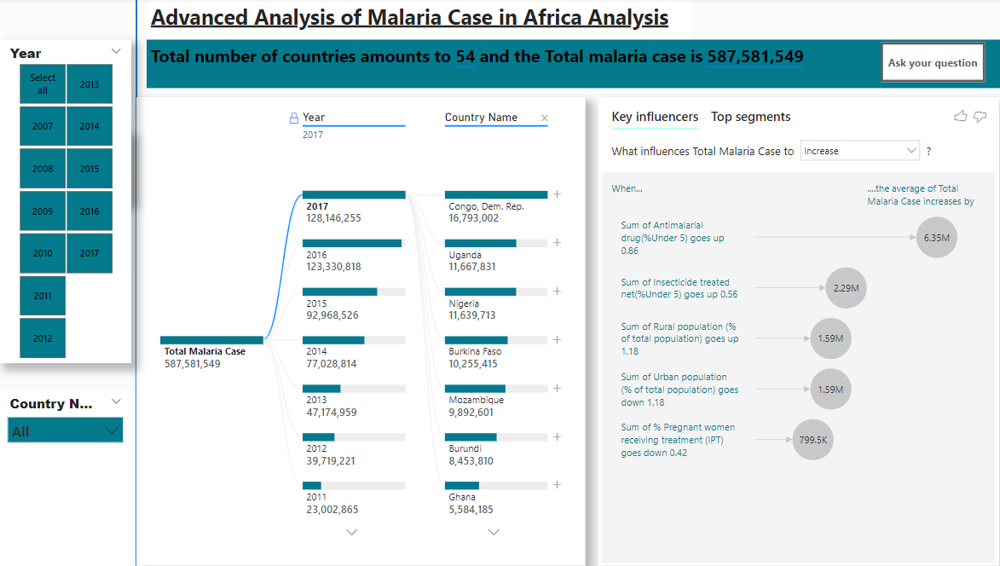

# Africa-Malaria-dashboard

## Africa Malaria Analysis

---

## Introduction

Malaria is a life-threatening disease spread to humans by some types of mosquitoes. It is mostly found in tropical countries. It is preventable and curable. The infection is caused by a parasite and does not spread from person to person. Symptoms can be mild or life-threatening. Mild symptoms are fever, chills and headache. Severe symptoms include fatigue, confusion, seizures, and difficulty breathing. Infants, children under 5 years, pregnant women, traveler’s and people with HIV or AIDS are at higher risk of severe infection.  Malaria can be prevented by avoiding mosquito bites and with medicines. Treatments can stop mild cases from getting worse. Malaria mostly spreads to people through the bites of some infected female Anopheles mosquitoes. 
The project aims to know exactly which countries lack basic amenities, have lesser advantage of overcoming this disease burden. Also, to know the countries with the highest malaria cases and if these countries are adhering to preventive measures or not. The projects analysis was carried out using Power bi.

## Problem statement
1.	Which country is the disease burden highest?
2.	Which country is more susceptible to having a high number of malaria cases because of the high rural population percentage?
3.	What country is adhering to the preventive measures that have been put in place?
4.	What is the ratio of urban population and rural population’s access to basic amenities?

## Data Source
This data was gotten from the Maven Analytics playground. Here is the (link) https://www.kaggle.com/datasets/lydia70/malaria-in-africa for your reference.

## Data Cleaning
The data was cleaned using power query editor. The null values were replaced with zero(0). Few columns that I found unnecessary were dropped. Converted the columns to percentages. I created a measures table using the Enter data from the home tab. There I housed all my measures for more efficiency and easy access to my measures. The function used mostly was SUM function to hae an explicit measure.

## Data Visualization
You can interact with the visualization (here) https://app.powerbi.com/view?r=eyJrIjoiZTUyNTlhM2QtOGIwNy00MjljLTg0MjktYTQ1MDhhZTAxNjhiIiwidCI6ImUyODE5OGNhLTExOWQtNDhmOC1iYzBlLTczMzIxYTM4YzJlMyJ9

## Malaria Dashboard

---

### Tooltip
The tooltip is a hidden page, but can be activated when you hover on the Total No of Malaria cases by year line chart

---

## Prevention Dashboard

---

## Basic Amenities

---

## Map

---

## Advanced Analysis

---

## Insights and Recommendations

1.	Surveillance in rural areas: The analysis shows that the disease burden is more concentrated at the rural areas compared to the urban areas. Hence, why the malaria cases reported in these underdeveloped countries are more. In Niger, it has been the only country with the highest percentage of rural population. This ultimately means the disease burden in these areas would be high. Public health practitioners need to channel more surveillance to these areas if there would ever be a decline in this disease burden in Africa.
   
3.	Interventions: 2007 had 10million cases of malaria reported as compared to 2017 which saw a drastic increase 128million. This goes to show that the interventions that have been ongoing for a while has proven abortive. And a more reliable approach to tackle this menace needs to be established.
   
5.	Improve access to basic amenities: Access to basic amenities will go a long way in curbing the incidence of malaria. Not only about access, but also illustrating creating awareness as to the effectiveness of maintaining a healthy lifestyle and clean environment will reduce the disease burden.

---

 
